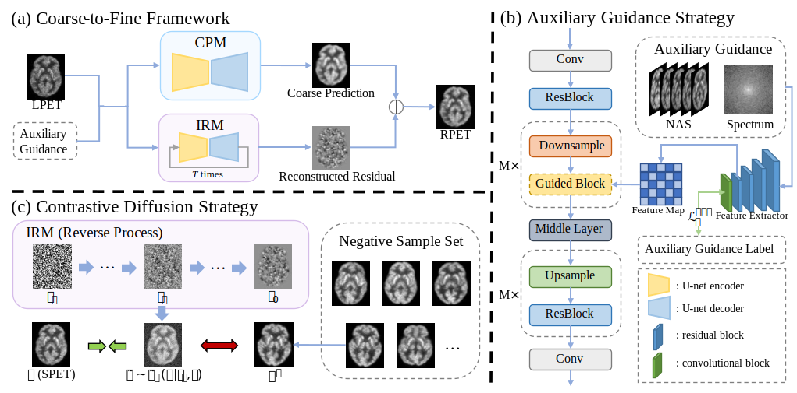

# PET-Reconstruction
This is the implementation of the **Contrastive Diffusion Model with Auxiliary
Guidance for Coarse-to-Fine PET Reconstruction** **(early acccpeted by MICCAI 2023)**, 
which is the **first work** that applies Diffusion to Pet Reconstruction.

[//]: # (codebase: https://github.com/Janspiry/Image-Super-Resolution-via-Iterative-Refinement)

## 1. Project Overview
<p align="center">
    

## 2. Environment Setup
The environment can be set up following the instructions below.

```
conda create --name diffpet python=3.8
source activate diffpet
conda install pytorch==1.8.0 torchvision==0.9.0 torchaudio==0.8.0 cudatoolkit=11.1 -c pytorch -c conda-forge
git clone https://github.com/wyhlovecpp/PET-Reconstruction.git
cd PET-Reconstruction
pip install -r requirements.txt
```
## 3. Code Structure
The code structure is as follows.
```
├── assets
│   └── model.svg           # model structure
├── config
│   └── sr_sr3_16_128.json  # config file for training and inference
├── core
│   ├── logger.py           # logger
│   ├── metrics.py          # function for evaluation
│   └── wandb_logger.py     # wandb logger
│   
├── datasets
│   ├── __init__.py         # dataloader
│   ├── LRHR_dataset.py     # dataset(Support .mat format data reading, you can replace with your own)
│   └── util.py             # dataset utils
├── model
│   ├── sr3_modules         # main_model
│   │   ├── diffusion.py    # diffusion model 
│   │   ├── unet.py         # unet structure
│   ├── __init__.py         # init
│   ├── base_model.py       # function for model
│   ├── model.py            # train and inference
│   └── networks.py         # Build CPM and IRM networks for model.py
├── inference.py            # inference
└── train.py                # train
```
## 4. Dataset
We conducted most of our low-dose brain PET
image reconstruction experiments on a public brain dataset, which is obtained
from the Ultra-low Dose PET Imaging Challenge 2022.
Each subject has a resolution of
128 × 128 × 128, and 2D slices along the z-coordinate were used for training and
evaluation. After you've prepared your 2D-slice datasets, you need to change the datasets config to your data path.

```
"datasets": {
        "train": {
            "name": "FFHQ",
            "mode": "HR", // whether need LR img
            "dataroot": "C:\\Users\\Administrator\\Desktop\\deblur\\dataset\\train_mat",
        }
```
## 5. Training and Inference
To train the model, you can run the following command.
```
python train.py -opt config/sr_sr3_16_128.json
```
To inference the model, you can run the following command.
```
python inference.py -opt config/sr_sr3_16_128.json
```
## 6. Acknowledgement
We would like to thank the authors of previous related projects for generously sharing their code and insights:
- [Image-Super-Resolution-via-Iterative-Refinement(SR3)](https://github.com/Janspiry/Image-Super-Resolution-via-Iterative-Refinement#conditional-generation-with-super-resolution)
- [Conditional Discrete Contrastive Diffusion(CDCD)](https://github.com/L-YeZhu/CDCD)